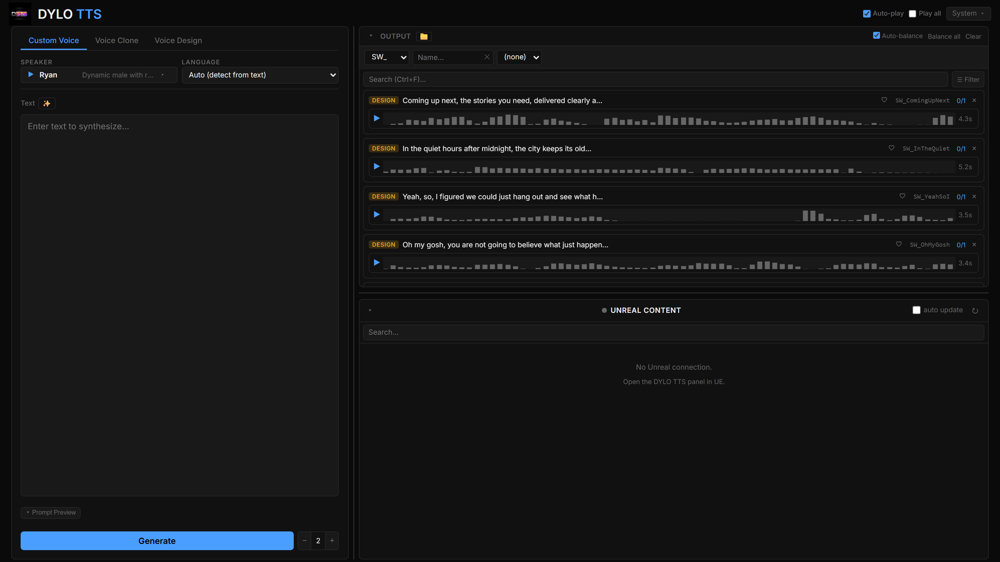
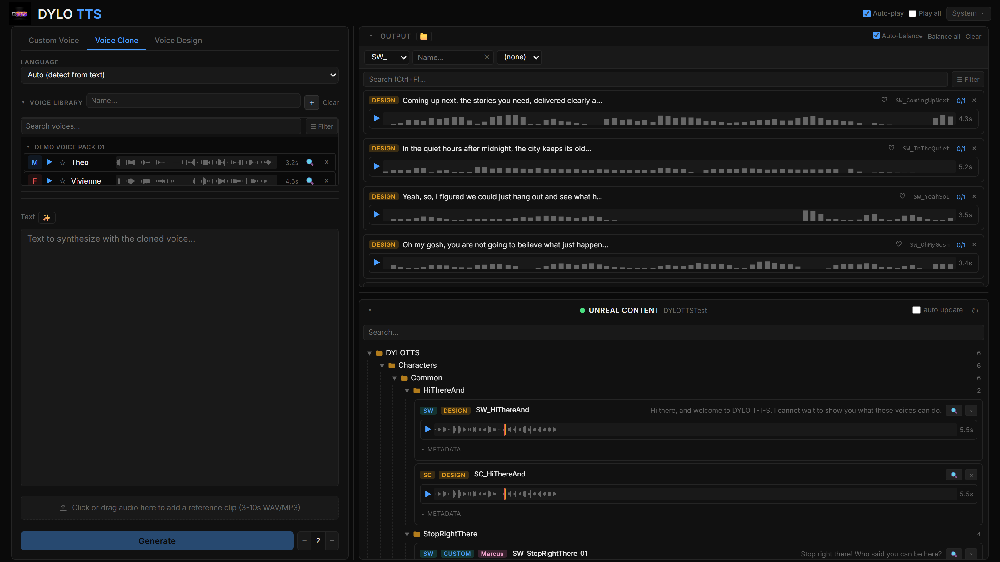
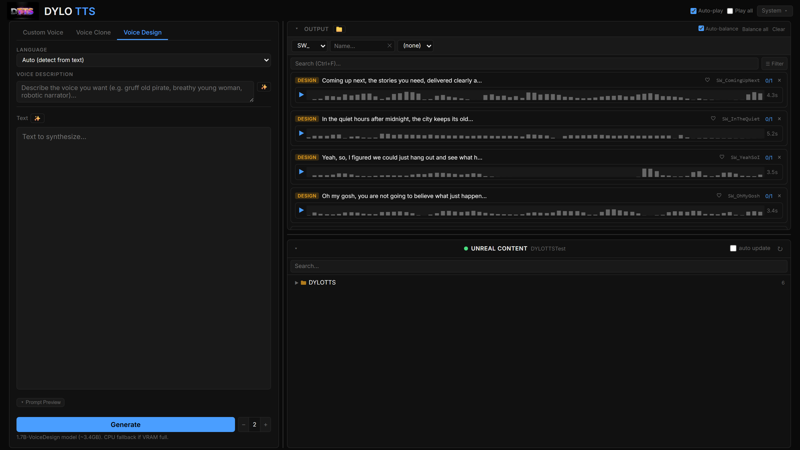
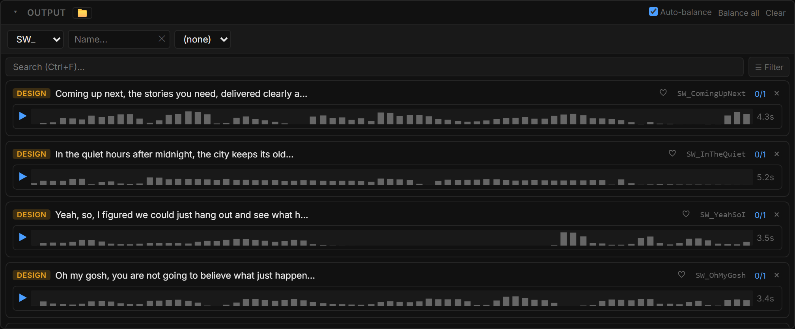

<h1 align="center">DYLO TTS</h1>

A browser based text to speech studio for Unreal Engine. Clone voices, design voices, and export SoundWave and SoundCue assets straight into your project. Everything runs locally on your GPU.

## Quick Start

1. Install from Fab (or drop the `DYLOTTS` folder into your project's `Plugins` folder) and enable it.
   

3. Click the **DYLO TTS** button in the toolbar. The first click downloads the studio (about 9.5 GB, one time), then opens it in your browser.
4. Pick a voice, type a line, press **Generate**.
5. Right click the clip and choose **Create SoundWaves** to import it into `Content/DYLOTTS/`.

That is the whole loop. Every later launch is instant.

## What You Can Do

- **Custom Voice** generate with built in or saved voices, plus emotion and delivery modifiers.
- **Voice Clone** clone a voice from a 10 to 30 second sample.
- **Voice Design** describe a voice in plain text and generate it.
- **Export** SoundWaves, SoundCues, or a single Random cue from many takes.
- **Standalone** launch from the Start Menu shortcut, no editor needed.

| Voice Clone | Voice Design | Output |
|---|---|---|
|  |  |  |

## Good to Know

- **Requirements:** Windows 10/11, UE 5.0 / 5.5 / 5.6 / 5.7, about 20 GB free, NVIDIA GPU recommended.
- **Your files:** voices and generations live in `Documents\DYLO TTS\`.
- **Offline:** after the first download, it works with no internet.
- **Nothing froze:** the first launch and first generation are the slow ones (download + model load). After that it is fast.

## Support

dylogamingofficial@gmail.com
